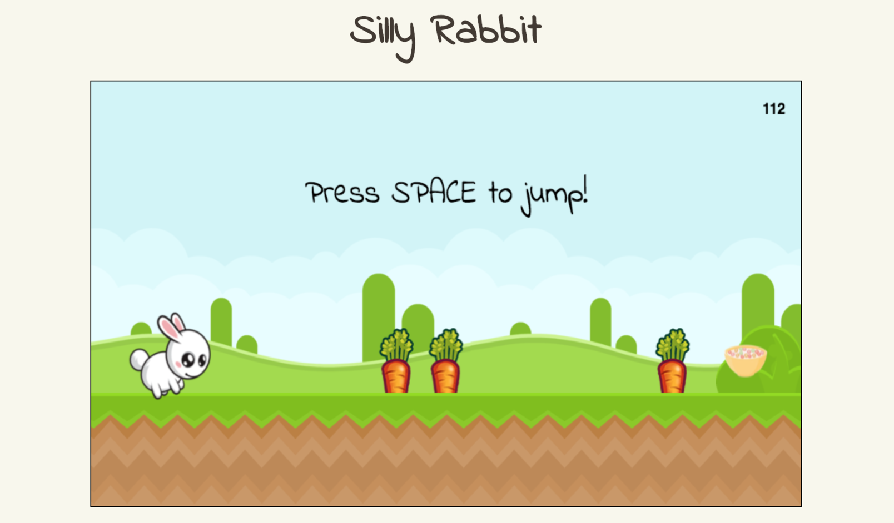

# Silly Rabbit


[Live](http://samuelkim.us/silly_rabbit)

Silly Rabbit is an endless runner game inspired by Google Chrome's T-Rex game.

## Instructions
You play as Silly Rabbit who chases after a bowl of The Cereal.  Avoid the carrots by jumping with the **SPACE** key.

## Technologies
- JavaScript
  * CreateJS
- HTML5 Canvas

## Features and Implementation
CreateJS libraries were used for all features of the game.

### Randomized Obstacle Positions
Only three obstacles(carrots) exist on the stage.  The carrots randomly spawn behind the stage.  When a carrot reaches the end of the stage, it is randomly moved behind the stage.

```js
  constructor() {
    ///
    this.body.setTransform(Math.random() * this.width + this.width,
        this.height - this.body.image.height - groundHeight + 50);
    ///
  }

  move(delta) {
    this.body.x -= delta * 400;
    this.hitBox.x = this.body.x;

    if (this.body.x + this.body.image.width <= 0 ) {
      this.body.x = Math.random() * this.width + this.width;
      this.hitBox.x = this.body.x;
    }
  }
```

### Collision
Collision was implemented by using CreateJS's EaselJS library. Using the `localToLocal()` and `hitTest()` method, collision occurs if the rabbit's hitbox would intersect with the point from the carrot's coordinate space, relative to the rabbit's hitbox.
```js
for (let i = 0; i < 3; i++) {
  let pt = carrots[i].hitBox.localToLocal(45, 290, rabbit.hitBox);
  // checks to see if rabbit hitbox intersects the Point.
  if (rabbit.hitBox.hitTest(pt.x, pt.y) && !gotHit) {
    rabbit.body.gotoAndPlay("faint");
    gotHit = true;
    setTimeout(onFaint, 950);
  }
}
```
